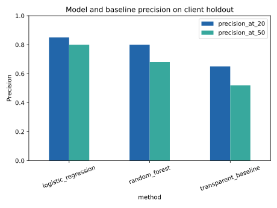

# Which visible content items should an editor review first?

**Lane:** Refresh / Content Opportunity Scoring

**Data scope:** Bundled anonymized FlyRank ML Internship starter slice
**Repository:** https://github.com/debug-soham/google-search-ml-pipeline

## Abstract

This project asks which visible content items an editor should review first when review capacity is limited. It uses the bundled anonymized FlyRank starter slice of 30,000 pseudonymized content items across 32 pseudonymized clients. A transparent visibility-and-freshness baseline is compared with logistic regression and random forest models using a client-held-out evaluation and a current-window decline proxy. Logistic regression achieved Precision@50 of 0.80, compared with 0.52 for the transparent baseline on the same 7,115-row holdout, whose positive base rate was 0.5165. The result is a public-safe, reason-coded candidate queue for human editorial review, not an automated publishing decision or a claim about Google's algorithm.

## Introduction / problem statement

The decision is simple: when an editor can inspect only a small number of pages, which ones should be inspected first? A false positive costs review time; a false negative can delay investigation of a page with weakening observed search performance. This project ranks candidates so a human editor can begin with the pages most likely to deserve attention.

## Data

The analysis uses `data/raw/content_refresh_anonymized.csv`, the bundled FlyRank ML Internship starter slice. It contains 30,000 rows, each representing one pseudonymized content item, across 32 pseudonymized clients; measures are trailing-90-day aggregates. No client names, domains, URLs, titles, raw queries, or credentials are used or published.

Pseudonymous `content_id` and `client_id` fields are context only; `client_id` is used solely for the grouped split. The model excludes IDs, `trend_direction`, `trend_pct`, `provider_used`, and `model_used`. The first two are excluded because the label is derived from the trend fields; using them would leak the answer.

## Methodology

The unit of analysis is one content item in the trailing-90-day starter-data window. The proxy target is `is_declining_label = 1` when `trend_direction == 'down'`. Numeric features include safe visibility, freshness, position, CTR, engagement, and content-property fields; categoricals are imputed and one-hot encoded, while numeric values use median imputation. A missing-keyword-context indicator preserves structured missingness without silently treating it as zero.

The baseline is a transparent score: prioritize pages with at least 300 impressions and 180 days since update, then add signals for low CTR (at most 1%) and positions 10–30. Every baseline recommendation receives a human-readable reason code. Logistic regression and random forest models are evaluated on the same grouped client holdout: 24 clients train the model and 8 entirely unseen clients form the 7,115-row test set. The leakage audit excludes target inputs, identifiers, product-decision flags, and features unavailable to the defined snapshot decision.

## Results

The test-set positive base rate is 0.5165. Precision@K is the primary measure because the output is a finite review queue.

| Method | ROC AUC | Average precision | Precision@20 | Precision@50 |
|---|---:|---:|---:|---:|
| Logistic regression | 0.598 | 0.600 | 0.85 | 0.80 |
| Random forest | 0.618 | 0.609 | 0.80 | 0.68 |
| Transparent baseline | 0.506 | 0.520 | 0.65 | 0.52 |

The best Precision@50 result is 0.80 for logistic regression, a 0.28 absolute increase over the baseline on this held-out client set. The forest has stronger overall ranking metrics but lower Precision@50; the queue therefore uses the logistic model, because the operational use case is top-of-list review.

*Figure 1. Both learned methods exceed the transparent baseline at the top of the held-out client ranking; logistic regression has the strongest Precision@50.*

## Limitations and honest framing

This is a starter-slice, current-window proxy analysis, not a future-window forecasting study. It shows out-of-sample ranking performance for the defined proxy on unseen clients, but cannot prove that a content refresh causes recovery, identify Google's ranking factors, or establish that a recommendation is appropriate without page-level editorial context. The trailing-90-day aggregate release also cannot support a strictly time-forward label; that is the most important upgrade for a full-warehouse continuation.

## Ranked recommendations

Use the exported queue as a review aid. Start with the highest-scored items, particularly reason codes such as `visible_stale_low_ctr|model_risk`; then assess topical relevance, factual accuracy, search-result context, internal linking, business priority, and measurement quality. Do not automatically publish, rewrite, delete, or alter metadata from this score alone.

Retrain or revisit the thresholds when the next valid measurement window arrives, reviewer acceptance falls, Precision@50 falls materially, or feature distributions shift. The published queue contains only safe aggregate fields and no row identifiers.

## Reproducibility

The executed [capstone notebook](https://github.com/debug-soham/google-search-ml-pipeline/blob/main/work/notebooks/capstone.ipynb), reusable [analysis helper](https://github.com/debug-soham/google-search-ml-pipeline/blob/main/work/scripts/sample_capstone.py), and [metrics receipt](https://github.com/debug-soham/google-search-ml-pipeline/blob/main/work/outputs/capstone_metrics.json) are in the repository. From a fresh clone, run `pip install -r requirements.txt`, then run the capstone notebook top-to-bottom. The random state is 42.

## Acknowledgments & data credit

Built on the [FlyRank ML Internship dataset](https://flyrank.ai).
